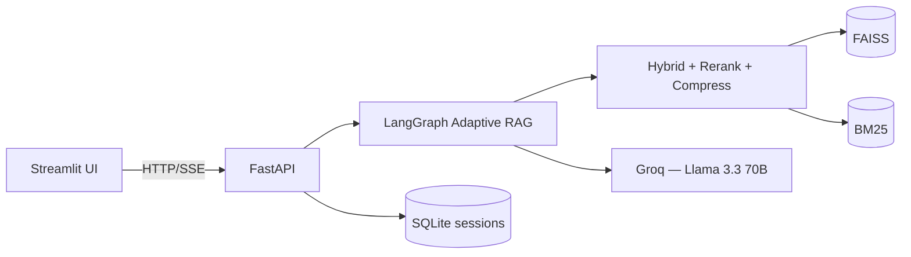

# 🧠 Adaptive RAG Engine

A self-correcting, hybrid-retrieval Retrieval-Augmented Generation system built entirely on **free, open-source infrastructure**. No OpenAI. No paid vector database. No paid search API required.

[](.github/workflows/ci.yml)
[](https://www.python.org/)
[](LICENSE)

> 📸 *Screenshot placeholder — add a screenshot of the Chat page here.*
> 🎬 *GIF placeholder — add a short demo GIF of an upload → chat → citations flow here.*

---

## Table of contents

- [What makes it "adaptive"](#what-makes-it-adaptive)
- [Features](#features)
- [Architecture](#architecture)
- [Tech stack](#tech-stack)
- [Project structure](#project-structure)
- [Installation](#installation)
- [Configuration](#configuration)
- [Running locally](#running-locally)
- [Running with Docker](#running-with-docker)
- [API documentation](#api-documentation)
- [Testing](#testing)
- [Deployment](#deployment)
- [Roadmap](#roadmap)
- [License](#license)
- [Acknowledgements](#acknowledgements)

---

## What makes it "adaptive"

Most "RAG tutorials" retrieve once and generate once. This system doesn't:

1. **Adaptive routing** — an LLM classifies every question and the graph takes a different path: search the local knowledge base, fall back to web search, or answer directly (greetings, meta-questions) with no retrieval at all.
2. **Adaptive retrieval strategy** — depending on the query's characteristics, the system picks between hybrid BM25+vector search, MMR (diversity), multi-query expansion (paraphrase-and-merge), or self-query filtering (scope to one uploaded document).
3. **Adaptive correction (corrective RAG)** — a relevance grader checks whether retrieved context actually answers the question. If not, the query is rewritten and retried (bounded retries), then falls back to web search if still unresolved. A second grader checks the generated answer for groundedness against its context and can trigger a bounded regeneration loop before ever returning a low-confidence, disclaimed answer.

This is implemented as a real [LangGraph](https://github.com/langchain-ai/langgraph) state machine — see [`docs/architecture.md`](docs/architecture.md) for the full diagram.

## Features

- 📄 **Multi-format ingestion**: PDF, DOCX, TXT, Markdown, CSV — drag & drop, multi-file, batch upload
- 🔍 **Hybrid retrieval**: BM25 (lexical) + FAISS (semantic), fused by weighted score
- 🎯 **Cross-encoder reranking**: `BAAI/bge-reranker-base` re-scores candidates for precision
- ✂️ **Contextual compression**: extracts only the query-relevant sentences from each chunk
- 💾 **Persistent FAISS + BM25 indexes**: survive a process restart, no re-indexing needed
- 🗂️ **Document management**: list, delete individual documents, duplicate detection (SHA-256), full knowledge-base reset
- 💬 **Streaming chat**: Server-Sent Events, with source citations, confidence scores, latency, and token usage on every answer
- 🧵 **Multi-session conversation memory**: SQLite-backed, survives a restart; export/reset per session
- 🌐 **Optional web search fallback**: Tavily, gracefully disabled (not crashed) when unconfigured
- 🖥️ **Modern Streamlit dashboard**: chat, document manager, live settings viewer, dark theme
- 🩺 **Observability**: structured JSON logging, request-ID correlation, per-turn retrieval/generation metrics
- 🐳 **Docker Compose** two-service deployment (backend + frontend)
- ✅ **72-test pytest suite** (unit + integration), zero `ruff` lint errors
- 🔁 **CI**: lint, type-check, test on every push/PR via GitHub Actions

## Architecture



Full system diagram, LangGraph state machine diagram, sequence diagram, and ingestion pipeline diagram: see **[`docs/architecture.md`](docs/architecture.md)**.

## Tech stack

| Layer | Technology | Cost |
|---|---|---|
| Orchestration | [LangGraph](https://github.com/langchain-ai/langgraph) | Free |
| LLM | [Groq](https://console.groq.com) — Llama 3.3 70B Versatile | Free tier |
| Embeddings | HuggingFace `sentence-transformers/all-MiniLM-L6-v2` | Free, local |
| Vector store | [FAISS](https://github.com/facebookresearch/faiss) | Free, local |
| Lexical search | [rank-bm25](https://github.com/dorianbrown/rank_bm25) | Free, local |
| Reranking | `BAAI/bge-reranker-base` (cross-encoder) | Free, local |
| Web search (optional) | [Tavily](https://tavily.com) | Free tier |
| Backend | FastAPI + Pydantic v2 | Free |
| Frontend | Streamlit | Free |
| Document parsing | PyMuPDF, python-docx, pandas | Free |

**Zero paid dependencies are required to run this project.**

## Project structure

```
adaptive-rag-engine/
├── backend/
│   ├── api/          # FastAPI app, routes, schemas, middleware, DI
│   ├── core/          # LangGraph state machine + exception hierarchy
│   ├── rag/            # LLMs, embeddings, retrievers, rerankers, memory,
│   │                    # loaders, indexing, prompts, search — all the
│   │                    # reusable RAG building blocks
│   ├── config/         # Settings (pydantic-settings), logging, constants
│   └── utils/           # IDs, timing helpers
├── frontend/
│   └── streamlit_app/   # Streamlit dashboard (chat, documents, settings, about)
├── tests/
│   ├── unit/            # Loaders, splitter, retrievers, reranker, graph nodes, settings
│   └── integration/      # Full API + full graph, via FastAPI TestClient
├── docker/               # Dockerfiles + docker-compose.yml
├── docs/                 # Architecture, API reference, deployment, testing, roadmap
├── .github/workflows/    # CI
├── data/                 # Persisted FAISS/BM25 indexes, SQLite DBs, uploads (gitignored)
└── requirements.txt
```

Full file-by-file breakdown: **[`docs/architecture.md`](docs/architecture.md)**.

## Installation

**Prerequisites**: Python 3.12+, a free [Groq API key](https://console.groq.com/keys).

```bash
git clone <this-repo-url>
cd adaptive-rag-engine

python3 -m venv .venv
source .venv/bin/activate        # Windows: .venv\Scripts\activate

pip install -r requirements.txt
```

> **Note on install time/size**: `sentence-transformers` pulls in `torch`, which is a large download (several hundred MB to a few GB depending on platform). This is normal — it's what lets embeddings and reranking run locally for free instead of calling a paid API.

## Configuration

```bash
cp .env.example .env
```

Open `.env` and set the one required value:

```bash
GROQ_API_KEY=your_groq_api_key_here
```

Everything else has a working default. Optional: set `TAVILY_API_KEY` to enable the web-search fallback — the app runs perfectly well without it (it just skips that fallback path).

Full list of every setting, what it does, and its default: **[`docs/architecture.md#configuration-reference`](docs/architecture.md#configuration-reference)**.

## Running locally

Two processes, in two terminals:

```bash
# Terminal 1 — backend
uvicorn backend.api.main:app --reload
# → http://localhost:8000  (docs at /docs)

# Terminal 2 — frontend
streamlit run frontend/streamlit_app/app.py
# → http://localhost:8501
```

Then open **http://localhost:8501**, upload a document, and start chatting.

> **A note on the run commands**: some project templates suggest `uvicorn backend.main:app` / `streamlit run frontend/app.py`. This project's actual (and documented, from the start of the build) structure is `backend/api/main.py` and `frontend/streamlit_app/app.py` — the commands above are correct for this repository.

## Running with Docker

```bash
cp .env.example .env   # set GROQ_API_KEY first
docker compose -f docker/docker-compose.yml up --build
```

- Frontend: http://localhost:8501
- Backend API docs: http://localhost:8000/docs

The backend and frontend are separate images/services (see [`docs/deployment.md`](docs/deployment.md) for why), talking to each other over Compose's internal network. FAISS/BM25 indexes and uploaded files persist in `./data` on the host via a bind mount.

## API documentation

Interactive Swagger UI: `http://localhost:8000/docs` (or `/redoc`) once the backend is running.

| Method | Path | Description |
|---|---|---|
| `POST` | `/api/v1/chat` | Ask a question (SSE streaming by default) |
| `POST` | `/api/v1/upload` | Upload one or more documents |
| `GET` | `/api/v1/documents` | List indexed documents |
| `DELETE` | `/api/v1/documents/{id}` | Delete one document |
| `POST` | `/api/v1/reset` | Clear the entire knowledge base |
| `GET` | `/api/v1/health` | Health + dependency configuration status |
| `GET` | `/api/v1/metrics` | Aggregate index/session statistics |
| `GET` | `/api/v1/config` | Current non-sensitive configuration |
| `GET`/`DELETE` | `/api/v1/chat/{session_id}` | Export / clear a conversation |

Full request/response schemas and examples: **[`docs/api_reference.md`](docs/api_reference.md)**.

## Testing

```bash
pip install -r requirements-dev.txt
pytest
```

72 tests (unit + integration), ~85% coverage of `backend/`. See **[`docs/testing.md`](docs/testing.md)** for how the suite avoids needing real Groq/HuggingFace calls (fakes injected at the same constructor seams the code was designed with, not brittle mocking).

## Deployment

Guides for Render, Railway, and Streamlit Cloud: **[`docs/deployment.md`](docs/deployment.md)**.

## Roadmap

See **[`docs/roadmap.md`](docs/roadmap.md)** for planned improvements (concurrent compression calls, real-time token streaming through the self-correction loop, additional vector store backends, etc.)

## License

MIT — see [`LICENSE`](LICENSE).

## Acknowledgements

Built on the shoulders of [LangChain](https://github.com/langchain-ai/langchain), [LangGraph](https://github.com/langchain-ai/langgraph), [Groq](https://groq.com), [FAISS](https://github.com/facebookresearch/faiss), [HuggingFace](https://huggingface.co), [FastAPI](https://fastapi.tiangolo.com), and [Streamlit](https://streamlit.io).

See also: [`CONTRIBUTING.md`](CONTRIBUTING.md) · [`CHANGELOG.md`](CHANGELOG.md) · [`CODE_OF_CONDUCT.md`](CODE_OF_CONDUCT.md) · [`SECURITY.md`](SECURITY.md)
