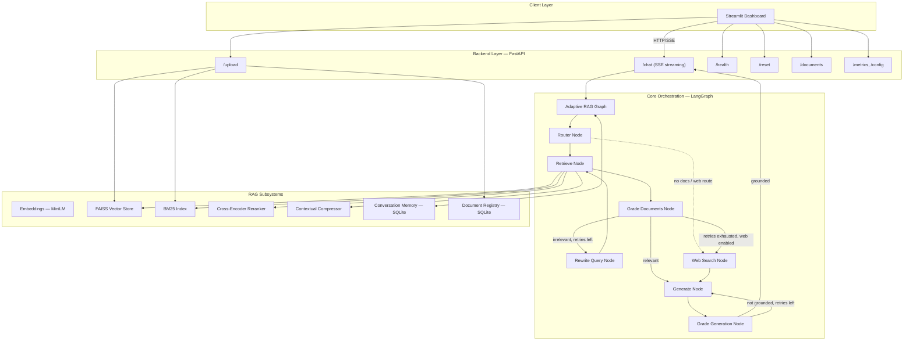
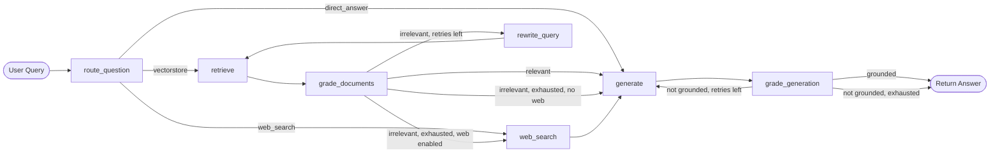
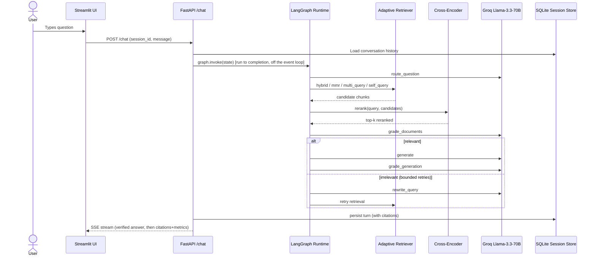
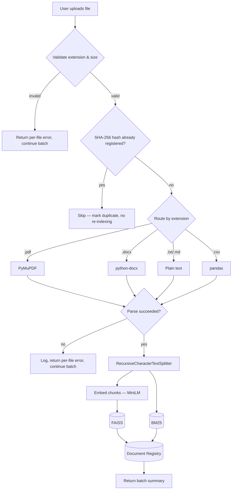
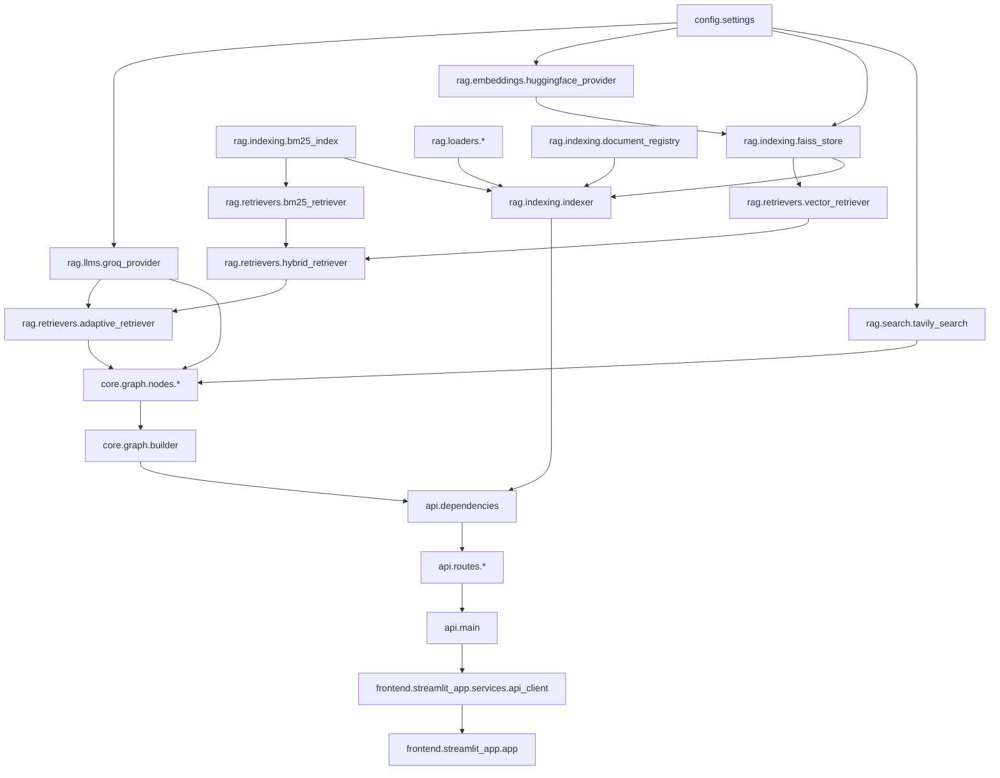

# Architecture

## System overview

## The adaptive RAG graph (LangGraph state machine)

Implementation: `backend/core/graph/builder.py` wires this exact graph; each node is a thin wrapper in `backend/core/graph/nodes/` around the RAG primitives in `backend/rag/`.

**Retry bounds** (both configurable, default 2): `MAX_DOCUMENT_GRADE_RETRIES`, `MAX_GROUNDEDNESS_RETRIES`. The graph always terminates — it never loops forever, even if the LLM keeps grading content as irrelevant/ungrounded.

## Sequence: one `/chat` request

**Why streaming happens after the graph completes, not token-by-token through it**: the self-correction loop may discard and regenerate the answer if it fails the groundedness check. You cannot un-stream tokens the client has already rendered. The API layer therefore runs the graph to completion (off the event loop, via `run_in_threadpool`), then streams the *final, verified* answer to the client in chunks — preserving a real-time UX without ever showing the user an answer that later gets thrown away.

## Ingestion pipeline

## Module dependency graph

Dependencies flow strictly one direction: `config → rag primitives → retrievers → graph nodes → graph builder → API → frontend`. No circular imports — verified in CI via a full `pkgutil.walk_packages` import audit.

## Key design decisions

| Decision | Rationale |
|---|---|
| Pydantic `GraphState` instead of `TypedDict` | Runtime validation of node return shapes catches bugs at dev time. |
| Lazy-loaded singletons for LLM/embeddings/reranker | Expensive model/client construction is deferred to first use and cached — fast cold starts, fast tests. |
| Hybrid retrieval (BM25 + vector) as the default strategy | Vector search alone misses exact keyword/entity matches; BM25 alone misses semantic paraphrase. |
| Bounded retry loops (not unbounded) | Guarantees termination even for genuinely unanswerable questions. |
| Tavily fully optional, checked once via `settings.tavily_enabled` | Keeps the zero-paid-dependency promise true for every code path, not just the happy path. |
| Separate backend/frontend processes over HTTP (not a monolith) | Independently deployable/scalable; the frontend never imports `backend.*`. |
| SQLite for sessions and the document registry (not in-memory dicts) | Conversation history and document metadata survive a process restart, at zero infra cost. |
| Structured JSON logging with request-ID correlation | Every log line from router → retrieval → grading → generation for one request is joinable. |
| `get_indexer`/`get_conversation_memory` compose FastAPI `Depends(...)` rather than calling singleton getters directly | Preserves `app.dependency_overrides` testability end-to-end — this was a real bug caught by the test suite (see `docs/testing.md`). |

## Configuration reference

All settings live in `backend/config/settings.py`, sourced from environment variables / `.env`. Only `GROQ_API_KEY` is required.

| Variable | Default | Purpose |
|---|---|---|
| `GROQ_API_KEY` | *(required)* | Groq API credential |
| `GROQ_MODEL` | `llama-3.3-70b-versatile` | LLM model name |
| `GROQ_TEMPERATURE` | `0.1` | Default sampling temperature |
| `TAVILY_API_KEY` | *(unset)* | Enables web-search fallback if set |
| `EMBEDDING_MODEL_NAME` | `sentence-transformers/all-MiniLM-L6-v2` | HuggingFace embedding model |
| `RERANKER_MODEL_NAME` | `BAAI/bge-reranker-base` | Cross-encoder reranker model |
| `FAISS_INDEX_DIR` | `data/faiss_index` | FAISS persistence directory |
| `BM25_INDEX_DIR` | `data/bm25_index` | BM25 persistence directory |
| `UPLOAD_DIR` | `data/uploads` | Raw uploaded file storage |
| `SESSION_DB_PATH` | `data/sessions.db` | Conversation history SQLite DB |
| `DOCUMENT_REGISTRY_DB_PATH` | `data/documents.db` | Document metadata SQLite DB |
| `CHUNK_SIZE` / `CHUNK_OVERLAP` | `1000` / `200` | Text splitter configuration |
| `MAX_UPLOAD_SIZE_MB` | `25` | Per-file upload size cap |
| `ALLOWED_UPLOAD_EXTENSIONS` | `.pdf,.docx,.txt,.md,.csv` | Accepted upload formats |
| `TOP_K_RETRIEVAL` / `TOP_K_RERANK` | `10` / `4` | Retrieval and reranking depth |
| `HYBRID_BM25_WEIGHT` | `0.4` | BM25 weight in hybrid fusion (vector weight = `1 - this`) |
| `MAX_DOCUMENT_GRADE_RETRIES` | `2` | Bounded query-rewrite retry limit |
| `MAX_GROUNDEDNESS_RETRIES` | `2` | Bounded regeneration retry limit |
| `LOG_LEVEL` / `LOG_JSON` | `INFO` / `true` | Logging verbosity and format |
| `API_HOST` / `API_PORT` | `0.0.0.0` / `8000` | Backend bind address |
| `CORS_ORIGINS` | `*` | Comma-separated allowed origins |
